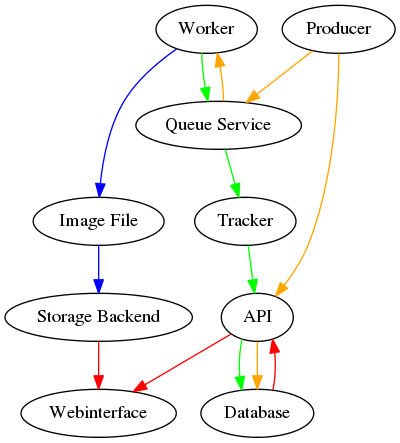

Openstack tutorial application
==============================

Workflow
--------

Frameworks
----------

* https://github.com/celery/kombu
* https://pillow.readthedocs.org/
* http://www.sqlalchemy.org/

Example image
-------------

.. image:: images/example.png

Vagrant environment
-------------------

The installation of Vagrant is described at https://docs.vagrantup.com/v2/installation/index.html.

.. code::

    $ vagrant up

Login with :code:`vagrant ssh`, change into the directory :code:`/home/vagrant/src` and
open a new screen or tmux session. Aftwards run the worker, producer, and 
tracker services in the foreground, each service in a separate window.

.. code::

    $ python worker.py
    $ python tracker.py
    $ python producer.py

RabbitMQ server
~~~~~~~~~~~~~~~

The webinterface of the RabbitMQ server is reachable on TCP port :code:`15672`. The login is
possible with the user :code:`guest` and the password :code:`secretsecret`.

MySQL server
~~~~~~~~~~~~

The password of the user :code:`root` is :code:`secretsecret`. The password of the user :code:`tutorial`
for the database :code:`tutorial` is also :code:`secretsecret`.

Example outputs
---------------

Producer service
~~~~~~~~~~~~~~~~

.. code::

    2015-02-12 22:21:42,870 generating 2 task(s)
    2015-02-12 22:21:42,876 generated task: {'width': 728, 'yb': 2.6351683415972076, 'uuid': UUID('66d5f67e-d26d-42fb-9d88-3c3830b4187a'), 'iterations': 395, 'xb': 1.6486035545865234, 'xa': -1.2576814065507933, 'ya': -2.8587178863035616, 'height': 876}
    2015-02-12 22:21:42,897 generated task: {'width': 944, 'yb': 2.981696583462036, 'uuid': UUID('6f873111-8bc2-4d73-9a36-ed49915699c8'), 'iterations': 201, 'xb': 3.530775320058914, 'xa': -3.3511031734533794, 'ya': -0.921920674639712, 'height': 962}
    2015-02-12 22:21:42,927 sleeping for 2.680171 seconds

Tracker service
~~~~~~~~~~~~~~~

.. code::

    2015-02-12 22:20:26,630 processing result be42a131-e4aa-4db5-80d1-1956784f4b81
    2015-02-12 22:20:26,630 elapsed time 5.749099 seconds
    2015-02-12 22:20:26,631 checksum 7ba5bf955a94f1aa02e5f442869b8db88a5915b7c2fb91ffba74708b8d799c2a

Worker service
~~~~~~~~~~~~~~

.. code::

    2015-02-12 22:20:59,258 processing task 20a00e9e-baec-4045-bc57-2cb9d8d1aa61
    2015-02-12 22:21:01,506 task 20a00e9e-baec-4045-bc57-2cb9d8d1aa61 processed in 2.246601 seconds
    2015-02-12 22:21:01,553 saved result of task 20a00e9e-baec-4045-bc57-2cb9d8d1aa61 to file /home/vagrant/20a00e9e-baec-4045-bc57-2cb9d8d1aa61.png
    2015-02-12 22:21:01,554 pushed result: {'duration': 2.246600866317749, 'checksum': 'faa0f00a72fac53e02c3eb392c5da8365139e509899e269227e5c27047af6c1f', 'uuid': UUID('20a00e9e-baec-4045-bc57-2cb9d8d1aa61')}

References
----------

* http://en.wikipedia.org/wiki/Julia_set
* http://en.wikipedia.org/wiki/Mandelbrot_set
* http://code.activestate.com/recipes/577120-julia-fractals/
