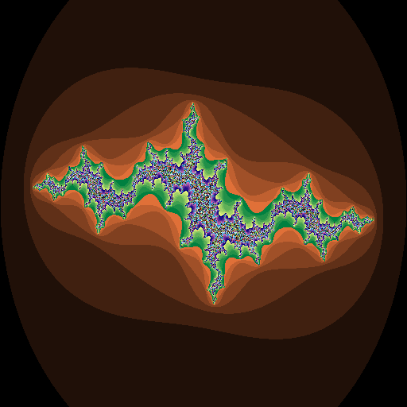
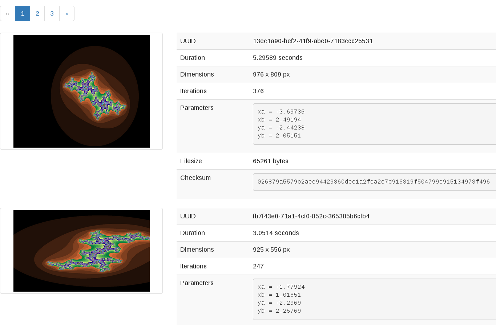

Usage
=====

Example image
-------------

Example outputs
---------------

Producer service
~~~~~~~~~~~~~~~~

.. code::

  2015-03-25 23:01:29.308 22526 INFO faafo.producer [-] generating 1 task(s)
  2015-03-25 23:01:29.344 22526 INFO faafo.producer [-] generated task: {'width': 510, 'yb': 2.478654026560605, 'uuid': '212e8c23-e67f-4bd3-86e1-5a5e811ee2f4', 'iterations': 281, 'xb': 1.1428457603077387, 'xa': -3.3528957195683087, 'ya': -2.1341119130263717, 'height': 278}
  2015-03-25 23:01:30.295 22526 INFO faafo.producer [-] task 212e8c23-e67f-4bd3-86e1-5a5e811ee2f4 processed: {u'duration': 0.8725259304046631, u'checksum': u'b22d975c4f9dc77df5db96ce6264a4990d865dd8f800aba2ac03a065c2f09b1e', u'uuid': u'212e8c23-e67f-4bd3-86e1-5a5e811ee2f4'}

Worker service
~~~~~~~~~~~~~~

.. code::

  2015-03-25 23:01:29.378 22518 INFO faafo.worker [-] processing task 212e8c23-e67f-4bd3-86e1-5a5e811ee2f4
  2015-03-25 23:01:30.251 22518 INFO faafo.worker [-] task 212e8c23-e67f-4bd3-86e1-5a5e811ee2f4 processed in 0.872526 seconds
  2015-03-25 23:01:30.268 22518 INFO faafo.worker [-] saved result of task 212e8c23-e67f-4bd3-86e1-5a5e811ee2f4 to file /home/vagrant/212e8c23-e67f-4bd3-86e1-5a5e811ee2f4.png

API Service
~~~~~~~~~~~
.. code::

  2015-03-25 23:01:29.342 22511 INFO werkzeug [-] 127.0.0.1 - - [25/Mar/2015 23:01:29] "POST /api/fractal HTTP/1.1" 201 -
  2015-03-25 23:01:30.317 22511 INFO werkzeug [-] 127.0.0.1 - - [25/Mar/2015 23:01:30] "PUT /api/fractal/212e8c23-e67f-4bd3-86e1-5a5e811ee2f4 HTTP/1.1" 200 -

Example webinterface view
-------------------------

