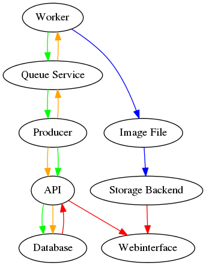

Workflow
--------

FIXME(berendt): Add new API service and webinterface to the workflow description.

* The producer generates a random number of tasks with random parameters and a UUID as identifier.
* The producer pushes the generated tasks into the exchange :code:`tasks`.
* The producer inserts a new record for each task into the database (including all parameters and the UUID).
* The producer sleeps for a random number of seconds and will generate more tasks after awakening.
* All messages in the :code:`tasks` exchange will be routed into the :code:`tasks` queue.
* The worker waits for new messages in the :code:`tasks` queue.
* After receiving a message the worker generates an image based on the received parameters and writes the result into a local file (identified by the UUID).
* After writing an image the worker pushes the result (the checksum of the generated image and the duration identified by the UUID) into the exchange :code:`results`.
* All messages in the :code:`results` exchange will be routed into the :code:`results` queue.
* The tracker waits for new messages in the :code:`results` queue.
* After receiving a message the tracker updates the duration and checksum value of the corresponding database record (identified by the UUID).
